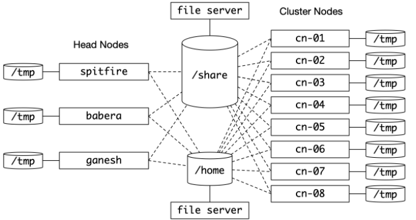

spitfire
========

This document is for users in the Korf Lab to set up their computer environments
on the Genome Center cluster. You may find that the organizational principles
here also apply to your main computer.

## Accounts ##

You'll need an account to connect to spitfire and the rest of the cluster.

* https://computing.genomecenter.ucdavis.edu
* Follow the "request account" link
* Select Ian Korf from the list of sponsors
* You will get an email with a link where you can set your password
* For help, email hpc-help@ucdavis.edu

## Genome Center cluster ##

The Genome Center cluster is composed of _head_ nodes that submit jobs,
_cluster_ nodes that work on jobs, and _file servers_ that store all of
the data.

While spitfire can submit jobs to the cluster nodes, most of the time we
use it as a loosely managed compute node. What exactly does _loosely_
mean? We don't need to submit jobs via `slurm`. Instead, we run jobs
directly via the shell. There is 1 main advantage: jobs start
immediately. There is also 1 main problem: other people are also using
the computer. As a result, sharing must be cooperative. There are no
hard rules, but rather social guidelines.

## ssh and scp ##

To log in to spitfire, use `ssh`. In the following examples, the user's
name is `username`. Switch this to whatever user name you have.

	ssh username@spitfire.genomecenter.ucdavis.edu

To copy files to spitfire, use `scp`.

	scp my_file username@spitfire.genomecenter.ucdavis.edu:/share/korflab/project/whatever

You can also copy whole directories with the `-r` option.

	scp -r my_dir username@spitfire.genomecenter.ucdavis.edu:/share/korflab/project/whatever

Of course, you can also `scp` stuff from spitfire back to your personal
computer.

	scp -r username@spitfire.genomecenter.ucdavis.edu:/share/korflab/project/whatever .

## Best practices ##

### RAM ###

RAM is the hardest resource to share. A good rule of thumb is never use
more than half of the total RAM. Since there is currently 256G RAM,
never run jobs that take more than 128G. If you need to use more than
128G, discuss with Ian first so we can warn other users. If you have no
idea how much RAM your process is using, run `top` or `htop` and examine
the memory usage.

### CPU ###

CPU is easily shared but you should still be cognizant of how much you
are using. There are 64 CPUs and you shouldn't use more than half (32)
at a time. However, if you have some kind of rush job, you can use all
of them if you `nice` your jobs to reduce their priority. In fact, if
you want to be a good lab citizen, you will `nice` all of your jobs. To
`nice` your job, simply put precede your command with the word `nice`.

### Storage ###

Looking at the cluster topology, it should be clear that spitfire
doesn't store any of your files directly. It has access to
`/share/korflab` and other mount points via a network.

Most Korflab members and spitfire users will be using the
`/share/korflab` mount point to store code, data, and experiments. This
is your main hub on the file system, not your home directory.

+ /share/korflab/data - Shared data files like genomes
+ /share/korflab/home - Your personal home away from home (see below)
+ /share/korflab/project - Group projects

For reasons that aren't obvious, your home directory at `/home/username`
is sometimes unstable. Most days it works great, but every once in a
while the fileserver has issues. If you're running a long compute that
requires access to your home directory, the job may fail. For this
reason **never use your home directory**. Instead, put _stuff_ in your
`/share/korflab/home/username` directory.

To determine how much space you have available, use `df`.

	cd /share/korflab
	df -h .

This will report the size of the partition and how much is in use. If
you want to know exactly how much is in each project directory (for
example), use `du`.

	du -h -d 1 /share/korflab/project

## Setting up your home ##

At the end of this section, you will have a directory structure that
looks like the following.

	/share/korflab/home/username
		bin
			pybench.py@
		lib
			korflib.py@
		spitfire
			README.md
			cluster.png
			python
				dust.py
				korflib.py
				pybench.py*

Create a home directory in `/share/korflab/home`

	cd /share/korflab/home
	mkdir username

Create the `bin` and `lib` directories.

	cd username
	mkdir bin lib

Your `/share/korflab/home/username` directory is the place to put all of
your GitHub repositories. Let's add one now.

	git clone https://github.com/KorfLab/spitfire.git

## Super-advanced shit for I/O intensive tasks ##

In the cluster topology diagram, you may have noticed that every
computer is attached to its own `/tmp` directory. If you have I/O
intensive operations, it's a good idea to use `/tmp` as a local cache.
This gives you a much higher speed to data and keeps traffic off the
network. Less traffic means more speed. This strategy also prevents you
from network outages as `/tmp` is attached directly to spitfire and not
the network.

Provisioning `/tmp` on spitfire is not a big deal, just copy stuff
there. But provisioning lots of tmp directories on the cluster isn't
trivial. You have to know which cluster nodes your jobs are going to
land on and set those up with data ahead of time. If you have these
kinds of needs, we need to discuss.

## Python ##

The version of python on the cluster is really old. Bring in a more modern
version with the `module` command.

	module load anaconda3

Put this in your `.bash_profile`, `.profile`, or whatever login script your
account is using so that you always load in anaconda3 every time you log into
spitfire.

Now let's make sure python is running properly.

	cd python
	python3 pybench.py

If everything is fine, your next step is to be able to run `pybench.py`
from anywhere on spitfire without using the explicit path, just like
_real_ programs like `ls`. In order to do that, you will need to make 3
important changes.

1. Edit your `PATH` environment variable
2. Edit your `PYTHONPATH` environment variable
3. Make symbolic links in `/share/korflab/home/username/bin

For steps 1 and 2 above, you will need to edit your `.profile` in your
`/home/username` directory. 

	nano ~/.profile

Edit the file to contain the following lines, substituting `username`.
In addition to setting the paths, there are a few other things to
improve your CLI experience.

	export KORFHOME=/share/korflab/home/username
	export PATH=$PATH:$KORFHOME/bin
	export PYTHONPATH=$PYTHONPATH:$KORFHOME/lib
	module load anaconda3
	alias ls="ls -F"
	alias rm="rm -i"
	alias cp="cp -i"
	alias mv="mv -i"

To instantiate these changes in your current shell do the following:

	source ~/.profile

Now change directory to your bin and create an alias for the
`pybench.py` so that it looks like it's in your bin directory. Anything
you put in your bin directory will now be part of the system executable
path and can be used just like `ls`.

	cd /share/korflab/home/username/bin
	ln -s ../spitfire/pybench.py .

Let's also make a similar kind of change to your `PYTHONPATH` so that
python can find your libraries.

	cd /share/korflab/home/username/lib
	ln -s ../spitfire/korflib.py .

Now, no matter where your script resides, it will be able to do an
`import korflib`.

Every time you write a program that you want to be executable anywhere,
make a symbolic link in bin, just as you did above. Every time you write
a library you want your python code to import, make a symbolic link in
lib, just as you did above.

## Python Best Practices ##

As far as style goes, you should slavishly copy the style of `korflib.py` and
`dust.py`. Let's be clear about what that means.

	+ Use tabs for left side indentation, not spaces
	+ Use 80 columns max except when that would be a burden
	+ Write and use libraries, both yours and other peoples'
	+ Programs should use argparse for the CLI

It's not really necessary to make your programs executable as was done with
`pybench.py` earlier. For example, the `dust.py` program in the repository
doesn't have execute permission. However, if you want to, you should probably
take the `.py` suffix off the program. Also, please don't do shit like this:

	def main:
		# whatever
	
	if __name__ == '__main__':
		main()

### Virtual environments ###

It's a good idea to use virtual environments.

	python3 -m venv <path_to_whatever>

Alternatively

	conda activate <name or path>

More info on this section later as it seems this topic is dynamic.
